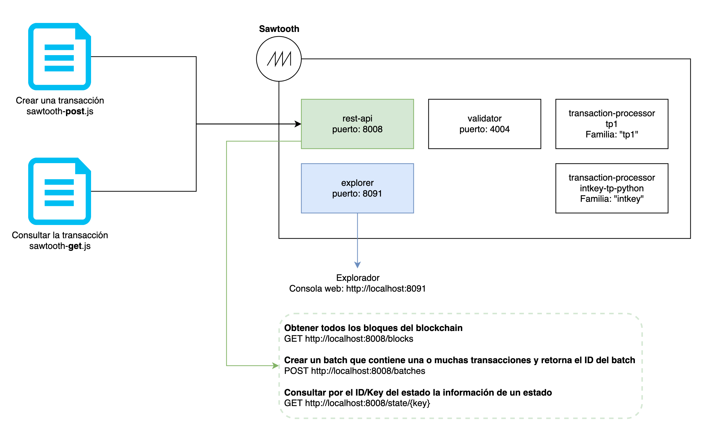

# Transaction processor personalizado con Sawtooth

Este proyecto te permite crear un blockchain usando el framework de **Hyperledger Sawtooth**.

El transaction processor es creado de forma personalizada y la familia que usa se llama `tp1`. La familia `tp1` se encarga de procesar autorizaciones médicas.

Cada autorización médica debe contar con ciertos requisitos, el único obligatorio (Por ahora) es que cuente con un "authorizationId". 

## Requerimientos

* [docker](https://docs.docker.com/engine/install/ubuntu/)
* [docker-compose](https://docs.docker.com/compose/install/)
* [node 10](https://nodejs.org/en/download/) ... talvez funcione con node v12.

## Dependencias Linux

```bash
./install-dependencies.sh
# Restart terminal
nvm install v10
```

## Despliegue local

```bash
./init.sh
./up.sh
./down.sh
```

## Arquitectura



## Archivos

* [Crear una transacción con sawtooth-post.js](https://github.com/juanalvarez123/sawtooth-kafka-mongo-hello/blob/master/app/sawtooth-post.js).
* [Consultar la transacción creada con sawtooth-get.js](https://github.com/juanalvarez123/sawtooth-kafka-mongo-hello/blob/master/app/sawtooth-get.js)

## URLs

### Sawtooth API

El API de Sawtooth permite crear transacciones (En bloques batch) y también consultar los bloques y los estados del blockchain:

```bash
# Obtener todos los bloques del blockchain
GET http://localhost:8008/blocks
```

```bash
# Crear un batch que contiene una o muchas transacciones y retorna el ID del batch
POST http://localhost:8008/batches
```

```bash
# Consultar por el ID/Key del estado la información de un estado
GET http://localhost:8008/state/{key}
```

### Sawtooth explorer

Explorador, ofrece una consola web amigable y permite consultar los bloques del blockchain:
[http://localhost:8091](http://localhost:8091)

## Código

En `app/` hay scripts en Node para crear y consultar transacciones.

En `tp1` se encuentra el transaction processor (Similar a un smart contract). Este transaction processor almacena los valores con un key (autorizationId) como un mapa o un hashtable.
